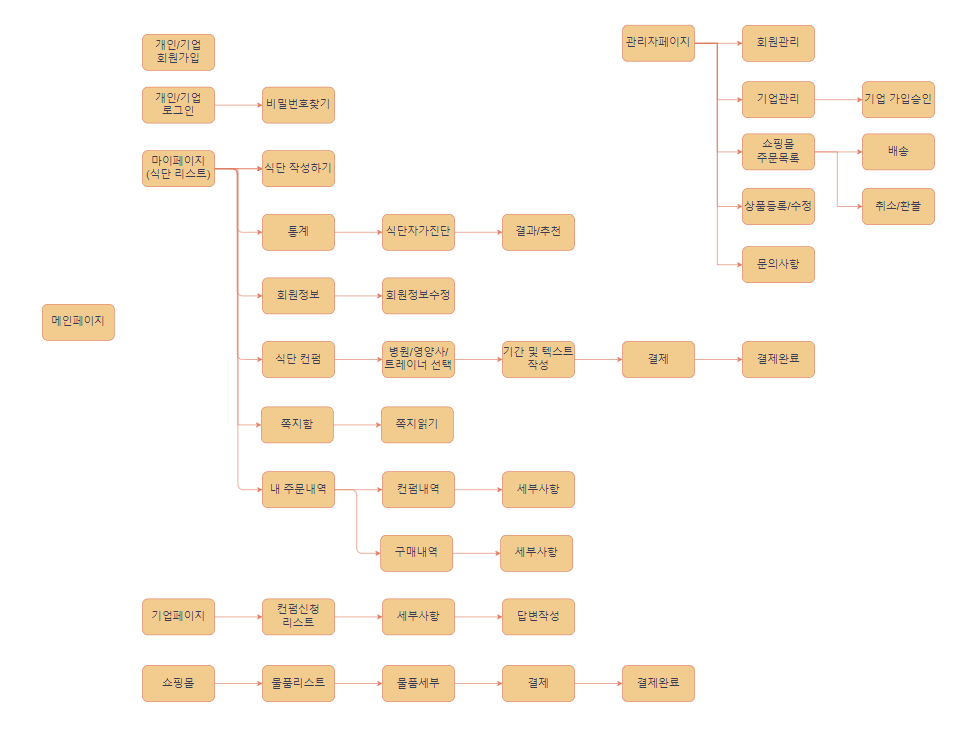

# MealMe🍖
- 식단 기록 웹사이트
- 사진 등록과 검색으로 쉽게 식단 세부정보 입력 가능
- 차트로 볼 수 있는 내 식단 영양 정보
- 각 분야 전문가에게 내 식단 컨설팅 신청
- 건강식품 판매

## 😋 프로젝트 소개
- 내 식단을 기록하고 쉽게 식사에 대한 정보를 확인할 수 있는 플랫폼입니다.
- 식단을 기록할때 식품의약품안전처의 "식품영양성분DB" api를 사용하여 이름으로 검색 후 식품 하나의 정확한 세부 데이터를 받아 올 수 있습니다.
- 내 정보에 따라서 권장 칼로리를 알 수 있고 기록된 식단의 영양분을 차트로 확인할 수 있어 부족한 영양분에 대해 알 수 있습니다.
- 기록된 식단을 쉽고 빠르게 컨설팅 받을 수 있습니다.
- 나에게 필요한 식품을 쇼핑몰에서 구매할 수 있습니다.
 

## 🕰️ 개발 기간
* 23.05.24일 - 23.07.24일

## 🧑‍🤝‍🧑 맴버구성
 - 팀장   : 이재우 - 헤더, 푸터, 사이드바, 퀵메뉴, 메인페이지, (개인/기업)로그인, 카카오로그인, 회원가입,
             비밀번호 찾기(메일전송), (개인/기업)회원정보 수정, 마이페이지, 식단 입력,
             쇼핑몰, 관리자로그인, DB테이블 설계, git관리, 발표 
 - 부팀장 : 이동재 - 관리자 페이지(회원관리, 기업회원가입승인, 쇼핑몰 상품등록, 결제정보확인)
 - 팀원1  : 김예슬 - 차트 페이지(오늘하루, 일간, 주간, 월간), 구매 목록, 리뷰작성, 리뷰 목록, 발표 PPT 제작
 - 팀원2  : 유정현 - 컨설팅 읽기 및 답변, 답변 읽기
 - 팀원3  : 정연재 - 기업리스트, 컨설팅 신청

## ⚙️ 개발 환경
- `Java 11`
- `JDK 11.0.15`
- **Database** : Oracle
- **ORM** : Mybatis

## 📌 주요 기능
### 메인 페이지 - <a href="" >상세보기 - WIKI 이동</a>

 

##  흐름도

## ERD

